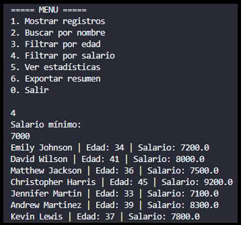
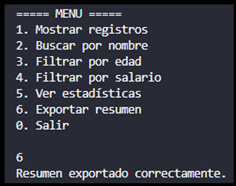
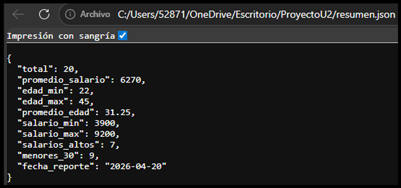

# Proyecto 1: Análisis de Datos con Dart


## 1. Objetivo del Proyecto


Desarrollar una aplicación de consola en Dart que permita cargar, procesar y analizar datos almacenados en archivos JSON mediante el uso de clases, estructuras de datos, funciones y mecanismos de Null Safety. La aplicación proporciona herramientas de búsqueda, filtrado, generación de estadísticas y exportación de reportes para facilitar el análisis de información.


---


## 2. Problema que Resuelve


El análisis manual de información almacenada en archivos de datos puede ser un proceso lento y propenso a errores. Este proyecto automatiza la lectura y procesamiento de registros de personas almacenados en formato JSON, permitiendo realizar búsquedas por nombre, filtrados por edad o salario y cálculos estadísticos de manera rápida y eficiente.


Además, genera automáticamente un archivo de resumen con los resultados obtenidos para facilitar la consulta y el almacenamiento de la información procesada.


---


## 3. Tecnologías Utilizadas


* **Dart** - Lenguaje de programación utilizado para desarrollar la lógica de la aplicación, aprovechando su tipado seguro y Null Safety.

* **Visual Studio Code** - Entorno de desarrollo integrado (IDE) utilizado para escribir, depurar y ejecutar el código Dart.

* **JSON** - Formato de intercambio de datos utilizado para almacenar los registros de personas y exportar los resultados estadísticos.

* **dart:io** - Librería de Dart que permite la lectura y escritura de archivos, así como la interacción con el sistema de archivos y la consola.

* **dart:convert** - Librería de Dart utilizada para convertir datos entre formato JSON y objetos Dart mediante `jsonDecode()` y `jsonEncode()`


---


## 4. Conceptos Aplicados


### Programación Orientada a Objetos (POO)


Se implementó la clase `Registro` para representar cada registro almacenado en el archivo JSON mediante atributos como nombre, edad y salario.


### Null Safety


Se utilizaron mecanismos de seguridad como:


* `required`

* `??`

* `int.tryParse()`

* `double.tryParse()`


para evitar errores relacionados con valores nulos o entradas inválidas.


### Lectura y Escritura de Archivos JSON


Se utilizaron las librerías `dart:io` y `dart:convert` para leer información desde archivos JSON y generar nuevos archivos con los resultados procesados.


### Estructuras de Datos


Se emplearon listas (`List`) y mapas (`Map`) para almacenar y manipular la información de los registros.


### Programación Funcional


Se utilizaron métodos como:


* `map()`

* `where()`

* `fold()`

* `reduce()`


para realizar búsquedas, filtrados y cálculos estadísticos de manera eficiente.


### Manejo de Excepciones


Se implementaron bloques `try-catch` para controlar posibles errores durante la lectura y escritura de archivos.


### Generación de Estadísticas


La aplicación calcula:


* Total de registros.

* Promedio de edades.

* Promedio de salarios.

* Edad mínima y máxima.

* Salario mínimo y máximo.

* Cantidad de personas menores de 30 años.

* Cantidad de personas con salario mayor o igual a $7000.


---


## 5. Instrucciones de Ejecución


Verificar que Dart esté instalado:


```bash

dart --version

```


Ubicarse en la carpeta del proyecto y ejecutar:


```bash

dart run main.dart

```


**Importante:** El archivo `datos.json` debe encontrarse en la misma carpeta que el archivo `main.dart`.


---


## 6. Capturas de Pantalla


### Menú Principal


Al ejecutar la aplicación se muestra un menú interactivo que permite acceder a todas las funcionalidades del sistema.


---


### Archivo de Datos JSON


El archivo `datos.json` contiene los 20 registros utilizados para realizar el análisis de información.


---


### Opción 1 - Mostrar Registros


Muestra todos los registros cargados desde el archivo JSON, incluyendo nombre, edad y salario de cada persona.


---


### Opción 4 - Filtrar por Salario


Permite ingresar un salario mínimo de $7000. El sistema muestra únicamente los registros que cumplen con dicha condición.





---


### Opción 6 - Exportar Resumen


Genera automáticamente un archivo denominado `resumen.json` que contiene las estadísticas calculadas a partir de los datos procesados.





---


### Resultados Generados


Visualización del contenido del archivo `resumen.json` generado por la aplicación.





---


## 7. Reflexión Personal


### ¿Qué aprendí?


Aprendí a trabajar con archivos JSON en Dart, convertir datos entre formato JSON y objetos, implementar Programación Orientada a Objetos y utilizar estructuras de datos para procesar información. También fortalecí mis conocimientos sobre Null Safety, manejo de excepciones y procesamiento de colecciones mediante métodos funcionales como `map()`, `where()` y `fold()`.


### ¿Qué fue difícil?


Uno de los aspectos más desafiantes fue implementar correctamente las funciones de búsqueda, filtrado y cálculo de estadísticas utilizando métodos funcionales. También fue necesario validar adecuadamente las entradas del usuario y manejar posibles errores durante la lectura y escritura de archivos JSON.


### ¿Qué mejoraría?


Como mejora futura, incorporaría opciones para agregar, editar y eliminar registros directamente desde la aplicación. También desarrollaría una interfaz gráfica para facilitar la interacción del usuario y permitir una visualización más amigable de los resultados generados.


