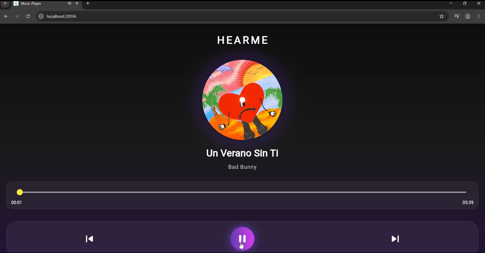
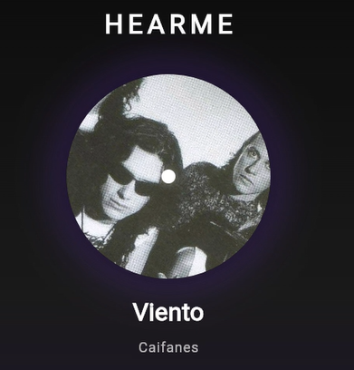
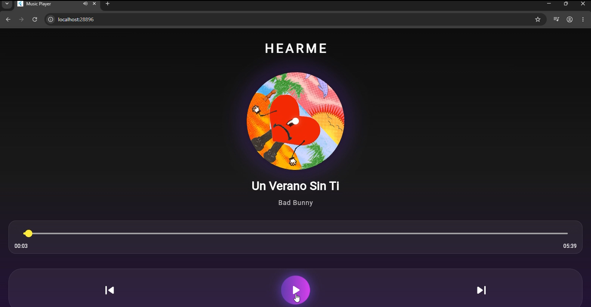

# Proyecto 3: Mini Reproductor de Música en Flutter


---


## 1. Objetivo del Proyecto


Desarrollar una aplicación móvil utilizando Flutter que funcione como un mini reproductor de música, permitiendo reproducir archivos de audio en formato MP3 mediante controles de reproducción como play, pause, siguiente y anterior.


La aplicación también muestra el progreso de la canción en tiempo real mediante una barra interactiva e integra animaciones para mejorar la experiencia visual del usuario.


---


## 2. Problema que Resuelve


La reproducción de contenido multimedia en dispositivos móviles requiere aplicaciones capaces de manejar audio en tiempo real, actualizar la interfaz dinámicamente y controlar el estado de reproducción.


Este proyecto automatiza la reproducción de música dentro de una aplicación móvil, permitiendo controlar canciones, visualizar el progreso del audio y ofrecer una interfaz interactiva y moderna.


---


## 3. Tecnologías Utilizadas


* **Flutter** - Framework utilizado para el desarrollo de la interfaz de la aplicación.

* **Dart** - Lenguaje de programación utilizado para la lógica del reproductor.

* **Visual Studio Code** - Entorno de desarrollo utilizado para escribir y ejecutar el proyecto.

* **just\_audio** - Librería utilizada para la reproducción de archivos de audio.

* **rxdart** - Librería utilizada para la actualización en tiempo real del progreso del audio.

* **Material Design** - Sistema de diseño utilizado para la construcción de la interfaz.


---


## 4. Conceptos Aplicados


### Programación Orientada a Objetos (POO)


Se implementaron clases como `MusicPlayerScreen` para estructurar la lógica del reproductor de música y organizar la funcionalidad de la aplicación.


---


### Manejo de Estado


Se utilizó `StatefulWidget` para actualizar la interfaz en tiempo real dependiendo del estado de reproducción, cambio de canciones y progreso del audio.


---


### Reproducción de Audio


Se utilizó la librería `just\_audio` para reproducir, pausar y cambiar canciones dentro de la aplicación.


---


### Animaciones


Se implementó `AnimationController` para generar la animación de rotación de la portada de la canción durante la reproducción.


---


### Streams


Se utilizó `rxdart` para actualizar en tiempo real la barra de progreso del audio y sincronizarla con la posición de la canción.


---


### Manejo de Assets


Se configuraron las carpetas `audio` e `images` dentro del proyecto para almacenar canciones e imágenes utilizadas en la interfaz.


---


## 5. Instrucciones de Ejecución


Verificar que Flutter esté instalado:


```bash

flutter --version

```


Descargar dependencias del proyecto:


```bash

flutter pub get

```


Ejecutar la aplicación:


```bash

flutter run

```


---


## 6. Capturas de Pantalla


### Pantalla Principal


La aplicación muestra el reproductor de música con la portada de la canción, controles de reproducción y diseño visual tipo vinilo.





---


### Interfaz del Reproductor


La aplicación presenta un diseño moderno con animación en la portada de la canción. La imagen se muestra en forma circular y gira durante la reproducción.





---


### Reproducción de Música


El usuario puede reproducir y pausar canciones mediante los controles del reproductor.





---


### Cambio de Canciones


La aplicación permite avanzar o retroceder entre canciones de la playlist.


---


### Barra de Progreso


Se muestra el avance de la canción en tiempo real mediante una barra interactiva que permite visualizar la posición del audio.


---


## 7. Reflexión Personal


### ¿Qué aprendí?


Aprendí a desarrollar una aplicación móvil utilizando Flutter con reproducción de audio, manejo de estado, animaciones y actualización en tiempo real de la interfaz mediante streams.


---


### ¿Qué fue difícil?


Uno de los principales retos fue la integración de la librería de audio y la sincronización del progreso de la canción con la barra de reproducción, además del manejo del estado entre canciones.


---


### ¿Qué mejoraría?


Como mejora futura, integraría reproducción en segundo plano, controles desde notificaciones del sistema y listas de reproducción personalizadas para mejorar la experiencia del usuario.


