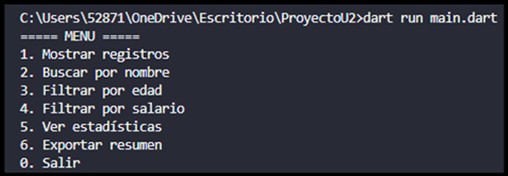
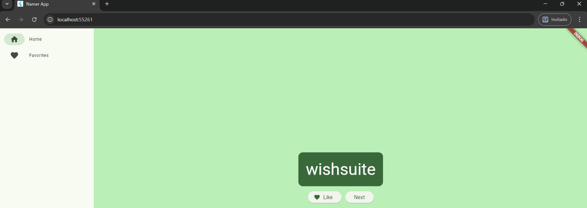
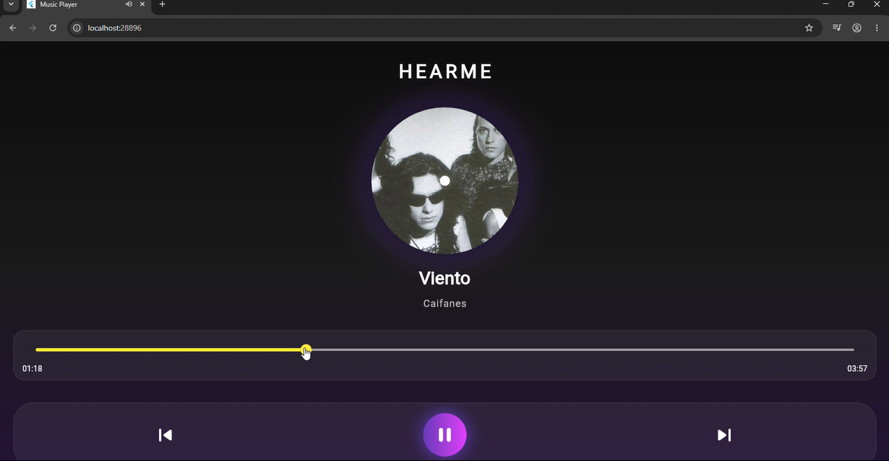

# Portafolio de Proyectos — Desarrollo de Aplicaciones para Dispositivos Móviles

<table>
<tr>
<td width="160">

</td>
<td>

## Información del Alumno

- **Nombre:** Cristal Ruiz Lozano  
- **Número de control:** 222310571  
- **Materia:** Desarrollo de Aplicaciones para Dispositivos Móviles  
- **Institución:** Instituto Tecnológico Superior de Lerdo  
- **Docente:** Jesús Salas Marín  
- **Semestre:** Octavo semestre  
- **Periodo:** Ene - Jun 2026  

</td>
</tr>
</table>

## Descripción General

Este portafolio reúne el trabajo desarrollado durante la materia de Desarrollo de Aplicaciones para Dispositivos Móviles, donde se implementaron aplicaciones móviles utilizando Flutter y Dart.

En él se integran diferentes proyectos enfocados en:

* Generación de contenido dinámico

* Manejo de estado en aplicaciones móviles

* Navegación entre pantallas

* Reproducción de audio

* Diseño de interfaces modernas y responsivas

* Organización de proyectos en estructuras profesionales

---

## 🧰 Tecnologías Utilizadas

| Tecnología | Descripción |
|------------|-------------|
|  Dart | Lenguaje principal para la lógica de las aplicaciones |
|  Flutter | Framework para desarrollo móvil multiplataforma |
|  Visual Studio Code | Entorno de desarrollo |
|  GitHub | Control de versiones y alojamiento de proyectos |
| 📐 Material Design | Sistema de diseño para interfaces modernas |

---

## 📁 Estructura del Repositorio

---

## 📱 Proyectos Incluidos

| Proyecto                                      | Descripción                                                                                                        | Tecnologías Implementadas         |
| :-------------------------------------------- | :----------------------------------------------------------------------------------------------------------------- | :-------------------------------- |
| **📊 Proyecto 1: Análisis de Datos con Dart** | Aplicación de consola para analizar datos almacenados en archivos JSON mediante búsquedas, filtros y estadísticas. | Dart, JSON, dart:io, dart:convert |

| Proyecto                                             | Descripción                                                                                         | Tecnologías Implementadas      |
| :--------------------------------------------------- | :-------------------------------------------------------------------------------------------------- | :----------------------------- |
| **📱 Proyecto 2: Generador de Palabras y Favoritos** | Aplicación móvil que genera palabras aleatorias y permite administrarlas en una lista de favoritos. | Flutter, Dart, Material Design |

| Proyecto                                      | Descripción                                                                                      | Tecnologías Implementadas         |
| :-------------------------------------------- | :----------------------------------------------------------------------------------------------- | :-------------------------------- |
| **🎵 Proyecto 3: Mini Reproductor de Música** | Aplicación móvil para reproducir música, controlar canciones y visualizar el progreso del audio. | Flutter, Dart, just_audio, rxdart |

---

## 📂 Evidencias

La carpeta **Evidencias/** contiene capturas del desarrollo de los tres proyectos:

* Interfaz de las aplicaciones

* Resultados de ejecución

* Funcionalidades principales

* Pruebas de funcionamiento

---

## 🎯 Competencias Desarrolladas

* Desarrollo de aplicaciones móviles con Flutter

* Programación en Dart

* Manejo de estado en aplicaciones

* Diseño de interfaces responsivas

* Organización de proyectos en GitHub

* Integración de multimedia en aplicaciones móviles

* Trabajo con estructuras de datos y archivos JSON

---

## 🚀 Objetivo del Portafolio

Demostrar las competencias adquiridas en el desarrollo de aplicaciones móviles mediante la implementación de proyectos funcionales, organizados y documentados profesionalmente.

---

## 📌 Nota

Este portafolio está diseñado para evidenciar el aprendizaje progresivo en el desarrollo de aplicaciones móviles utilizando Flutter y Dart.

